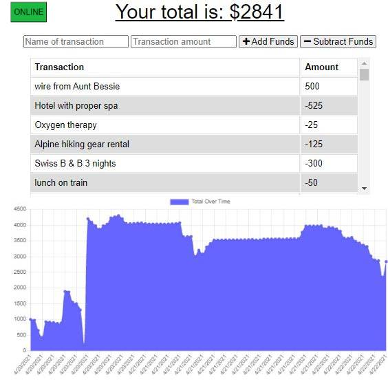

    
  
  # any-budget Progressive Web Application
  ## anytime, anywhere, any-budget tracks your expenses and current balance with or without an internet connection
  ## UA Web Coding Bootcamp Challenge - Week 19
  
  ## Description  
  Any-Budget is a PWA (Progressive Web Application) that can be added add as an app on the home screen of a mobile device and used to track budget expenses and deposits, with or without a data network or internet connection. Offline transactions are reconciled when connection is reestablished.   

  **NOTE: A status "button" informs the user when the application is online (green) or offline (orange)** 

  Any-Budget is based on source code from the University of Arizona's Web Developer Bootcamp, Module 19, and is subject to that program's copyright and/or restrictions.

  ## Heroku Link
  The application is deployed at: [vl-any-budget](https://vl-any-budget.herokuapp.com/)  
  
  ## Table of Contents  
  * [Installation](#Installation)  
  * [Usage](#Usage) 
  * [User_Story](#User_Story)  
  * [User_Requirements](#User_Requirements)  
  * [Questions](#Questions)    
  * [License](#License)
  ## Installation  
  To install as a mobile app: 
  
  1. Open Safari and navigate to [vl-any-budget](https://vl-any-budget.herokuapp.com/).

  2. Tap  **Share**.

  3. Tap **Add to Home Screen**.

  4. Name your app and then tap **Add** in the upper-right corner.

  5. Check your Home Screen to see the app.

* Android:

  1. Open Chrome and navigate to [vl-any-budget](https://vl-any-budget.herokuapp.com/)  .

  2. In in the upper right corner of Chrome, tap the **Menu** icon.

  3. Tap the **Add to Home Screen** icon.

  4. Name your app and then tap **Add** below the prompt.

  5. If there is an "Add to Home screen?" prompt, tap **Add**.

  6. Check your Home Screen to see the app.  

  ## User_Story 
 * AS AN avid traveler
 * I WANT to be able to track my withdrawals and deposits with or without a data/internet connection 
   SO THAT my account balance is accurate when I am traveling 

  ## User_Requirements
  GIVEN a budget tracker without an internet connection  
  * WHEN the user inputs an expense or deposit  
    THEN they will receive a notification that they have added an expense or deposit  
  * WHEN the user reestablishes an internet connections  
    THEN the deposits or expenses added while they were offline are added to their transaction history and their totals are updated
 
  

  ## Questions
  For more information, contact  
  * [vloebel on GitHub](https://github.com/vloebel)  
  * [VickyLoebel@gmail.com](mailto:VickyLoebel@gmail.com)
  ## License
  This software is distrubted without warranty under the MIT license agreement. To view terms and conditions, visit the [MIT License website](https://opensource.org/licenses/MIT).
      
